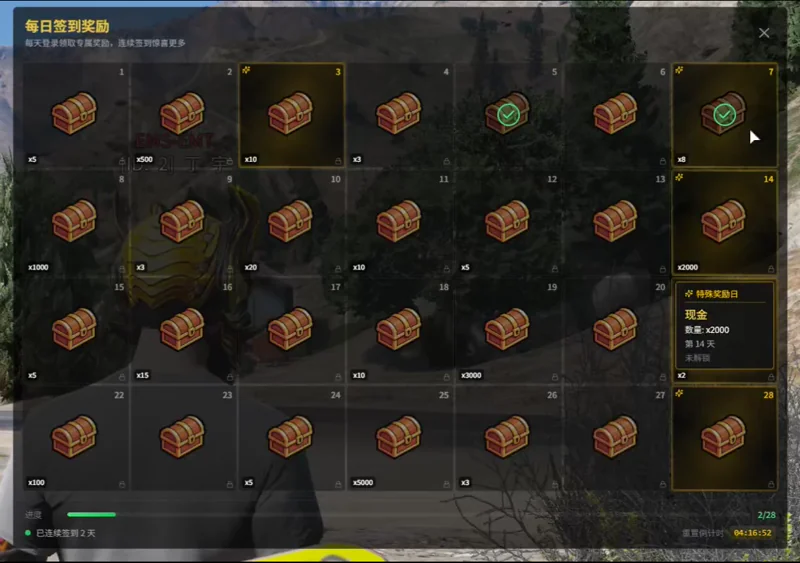

<!-- PROJECT LOGO -->
<div align="center">
  <h1>🎁 dy_daily_reward</h1>
  <p><strong>FiveM 每日签到奖励系统</strong></p>
  <p>现代化游戏内嵌 UI，支持 ESX 框架</p>

  <br />

  <a href="#快速开始">快速开始</a>
  ·
  <a href="#配置说明">配置说明</a>
  ·
  <a href="https://github.com/DyroS3/dy_daily_reward/issues">报告 Bug</a>
  ·
  <a href="https://github.com/DyroS3/dy_daily_reward/issues">功能建议</a>
</div>

<br />

<!-- BADGES -->
<div align="center">

[](https://github.com/DyroS3/dy_daily_reward/releases/latest)


</div>

---

## 📸 预览

<div align="center">
  
</div>

---

## ✨ 功能特性

- 🎮 **游戏内嵌 UI** - 半透明深色主题，完美融入游戏场景
- 📅 **28天签到周期** - 每月自动重置
- ⭐ **特殊日奖励** - 可自定义任意天数为特殊奖励日（金色动画效果）
- 🔥 **连续签到奖励** - 连签天数越多，奖励越丰厚
- 🚗 **多种奖励类型** - 支持现金、物品、武器、载具
- ✨ **精美动画** - 开启/关闭动画、领取动画、特殊日旋转光芒
- 🔊 **音效反馈** - 领取奖励时播放音效
- 📱 **实时倒计时** - 显示距离下次重置的时间

---

## 📋 依赖

| 依赖 | 说明 |
|------|------|
| [ox_lib](https://github.com/overextended/ox_lib) | UI 通知 & Callback |
| [oxmysql](https://github.com/overextended/oxmysql) | 数据库 |
| [es_extended](https://github.com/esx-framework/esx_core) | ESX 框架 |

---

## 🚀 快速开始

### 环境依赖

- Node.js 18+
- FiveM Server
- MySQL / MariaDB

### 安装步骤

1. **下载资源**
   ```bash
   cd resources
   git clone https://github.com/DyroS3/dy_daily_reward.git
   ```

2. **构建前端**
   ```bash
   cd dy_daily_reward/web
   npm install
   npm run build
   ```

3. **配置 server.cfg**
   ```cfg
   ensure ox_lib
   ensure oxmysql
   ensure es_extended
   ensure dy_daily_reward
   ```

4. **启动服务器** - 数据库表会自动创建

---

## ⚙️ 配置说明

编辑 `config.lua` 自定义奖励：

```lua
---@type table<number, RewardConfig>
Config.Rewards = {
    [1]  = { name = '金币', type = 'money', quantity = 500 },
    [7]  = { name = '神秘宝箱', type = 'item', item = 'mysterybox', quantity = 1, special = true },
    [28] = { name = '超级载具', type = 'vehicle', model = 'adder', quantity = 1, special = true },
}
```

### 奖励类型

| 类型 | 说明 | 必填字段 |
|------|------|----------|
| `money` | 现金 | `quantity` |
| `bank` | 银行存款 | `quantity` |
| `item` | 物品 | `item`, `quantity` |
| `weapon` | 武器 | `item` |
| `vehicle` | 载具 | `model` |

### 连续签到奖励

```lua
Config.StreakBonus = {
    [7]  = { type = 'money', quantity = 2000 },
    [14] = { type = 'money', quantity = 5000 },
}
```

---

## 🎮 使用方法

| 操作 | 说明 |
|------|------|
| `/dailyreward` | 打开签到界面 |
| `ESC` | 关闭界面 |
| 点击格子 | 领取当日奖励 |

---

## 🖼️ 自定义图片

将物品图片放入 `web/images/` 目录：

```
web/images/
├── no_item.png          # 备用图片
├── items/
│   ├── leather.png      # 物品图片 (与 config 中 item 字段同名)
│   └── money.png
└── vehicles/
    └── adder.png        # 载具图片 (与 model 字段同名)
```

支持 `.png` 和 `.webp` 格式。

---

## 📁 项目结构

```
dy_daily_reward/
├── fxmanifest.lua          # 资源清单
├── config.lua              # 配置文件
├── client/
│   └── main.lua            # 客户端脚本
├── server/
│   └── main.lua            # 服务端脚本
├── sql/
│   └── daily_reward.sql    # 数据库结构
└── web/                    # 前端 (React + Vite + Tailwind)
    ├── src/
    │   └── components/
    ├── images/             # 奖励图片
    └── dist/               # 构建输出
```

---

## 🛠️ 开发

```bash
cd web
npm run dev
```

访问 `http://localhost:5173` 预览 UI（开发模式）

---

## 🤝 贡献

欢迎提交 Pull Request！

1. Fork 本仓库
2. 创建分支 (`git checkout -b feature/AmazingFeature`)
3. 提交更改 (`git commit -m 'feat: Add AmazingFeature'`)
4. 推送分支 (`git push origin feature/AmazingFeature`)
5. 提交 Pull Request

---

## 📄 License

本项目基于 [MIT License](LICENSE) 开源。

---

## 👤 作者

**DingYu** - [@DyroS3](https://github.com/DyroS3)

---

<div align="center">
  <sub>如果这个项目对你有帮助，请给一个 ⭐ Star！</sub>
</div>
